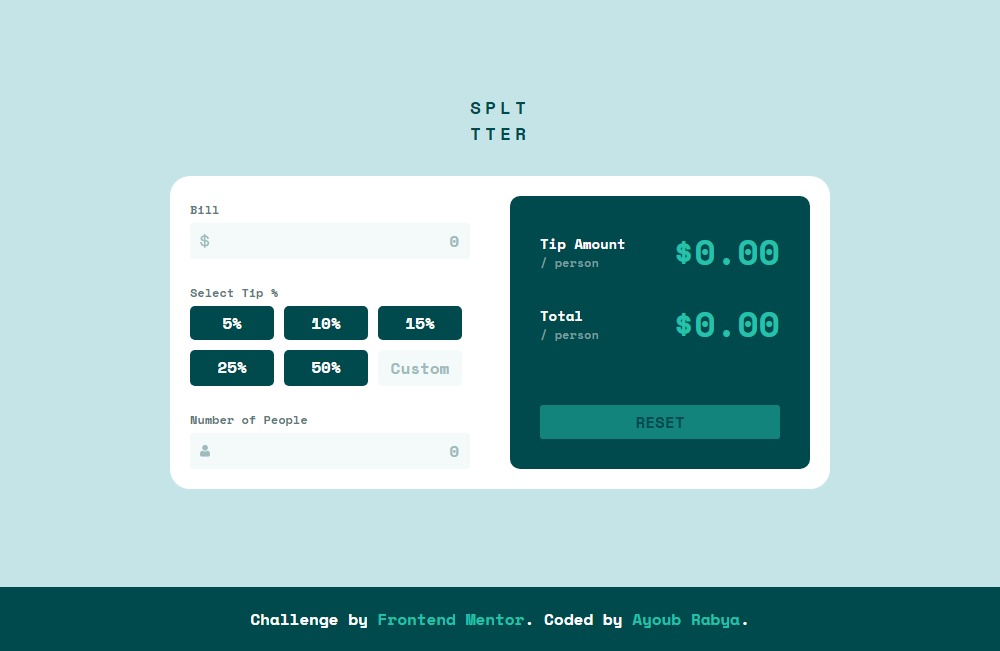
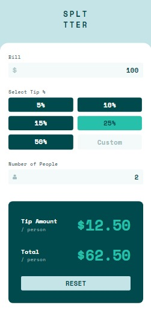

# Frontend Mentor - Tip calculator app solution

This is a solution to the [Tip calculator app challenge on Frontend Mentor](https://www.frontendmentor.io/challenges/tip-calculator-app-ugJNGbJUX).

## Table of contents

- [Overview](#overview)
  - [The challenge](#the-challenge)
  - [Screenshot](#screenshot)
  - [Links](#links)
- [My process](#my-process)
  - [Built with](#built-with)

## Overview

### The challenge

Users should be able to:

- View the optimal layout for the app depending on their device's screen size
- See hover states for all interactive elements on the page
- Calculate the correct tip and total cost of the bill per person

### Screenshot

### Links

- Solution URL: [solution URL](https://www.frontendmentor.io/solutions/tip-calculator-nyPWCxZGVU)
- Live Site URL: [Live site URL](https://ayoubrabiae.github.io/tip_calculator/)

## My process

### Built with

- Semantic HTML5 markup
- CSS custom properties
- Flexbox
- CSS Grid
- Mobile-first workflow
- JavaScript
- DOM

## Author

- Frontend Mentor - [@Ayoubrabiae](https://www.frontendmentor.io/profile/Ayoubrabiae)
- LinkedIn - [Ayoub RABIYA](https://www.linkedin.com/in/ayoub-rabiya/)
